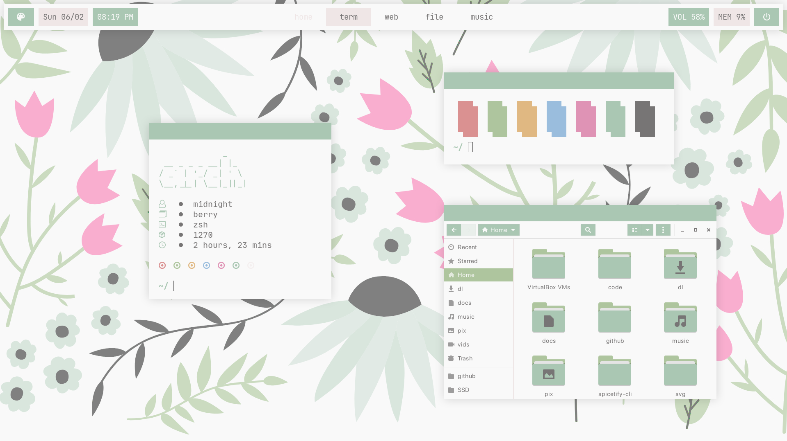
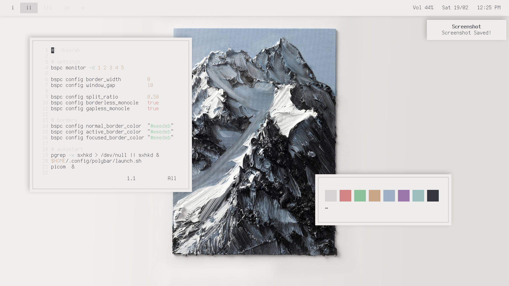

<h1 align="center"> 🌸 Dotfiles 🌸 <h1>
  
<h1 align="center"> Floral 🌷  </h1>
  

  
# Requirements
- [BerryWM](https://berrywm.org/)
- [Kitty](https://sw.kovidgoyal.net/kitty/)
- [SXHKD](https://github.com/baskerville/sxhkd)
- [Polybar](https://github.com/polybar/polybar)
- [Rofi](https://github.com/davatorium/rofi) 
- [JetBrainsMono](https://www.jetbrains.com/lp/mono/)
- [Iosevka Nerd Font](https://github.com/ryanoasis/nerd-fonts/tree/master/patched-fonts/Iosevka) (Better icon rendering than JetBrainsMono Nerd Font)
- [SF Pro Display](https://github.com/sahibjotsaggu/San-Francisco-Pro-Fonts)
- [ibhagwan Picom fork](https://github.com/ibhagwan/picom)
  
# Stuff in the image
- [Fetch](https://github.com/smartsyncing/dotfiles/blob/main/zsh/autostart)
- [Panes](https://github.com/stark/Color-Scripts/blob/master/color-scripts/panes)
- [Nautilus](https://github.com/GNOME/nautilus)

---
<h1 align="center"> Mountain 🗻 </h1>

# Requirements
- [BSPWM](https://github.com/baskerville/bspwm)
- [URXVT](https://sw.kovidgoyal.net/kitty/)
- [SXHKD](https://github.com/baskerville/sxhkd)
- [Polybar](https://github.com/polybar/polybar)
- [Rofi](https://github.com/davatorium/rofi)
- [Terminus](http://terminus-font.sourceforge.net/)
- [ibhagwan Picom fork](https://github.com/ibhagwan/picom)
  
